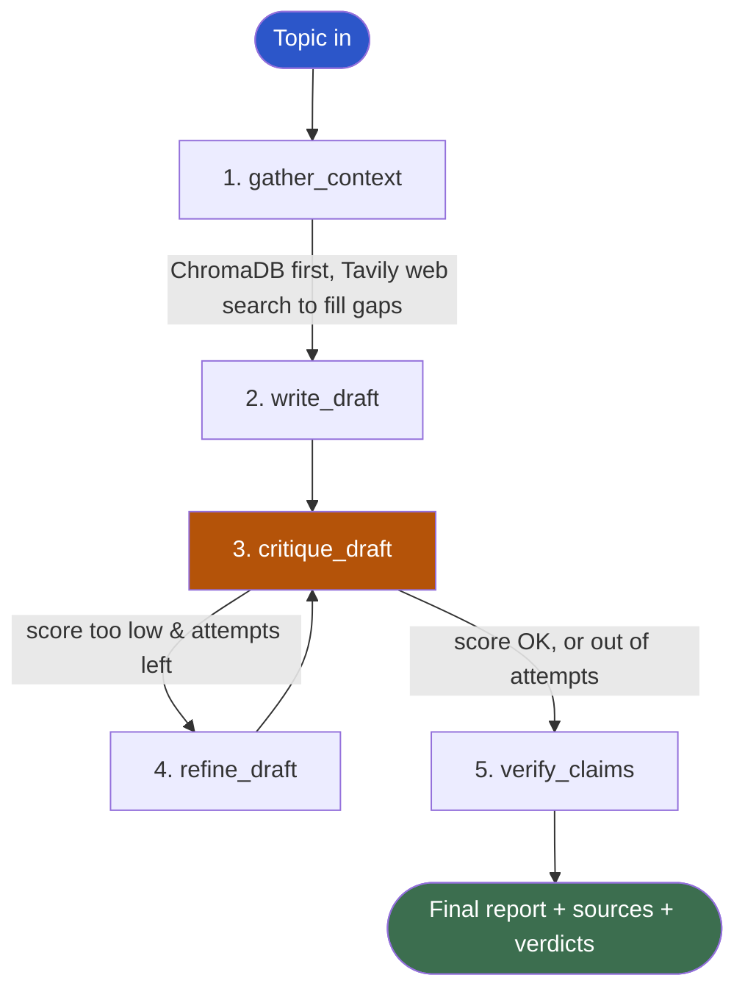
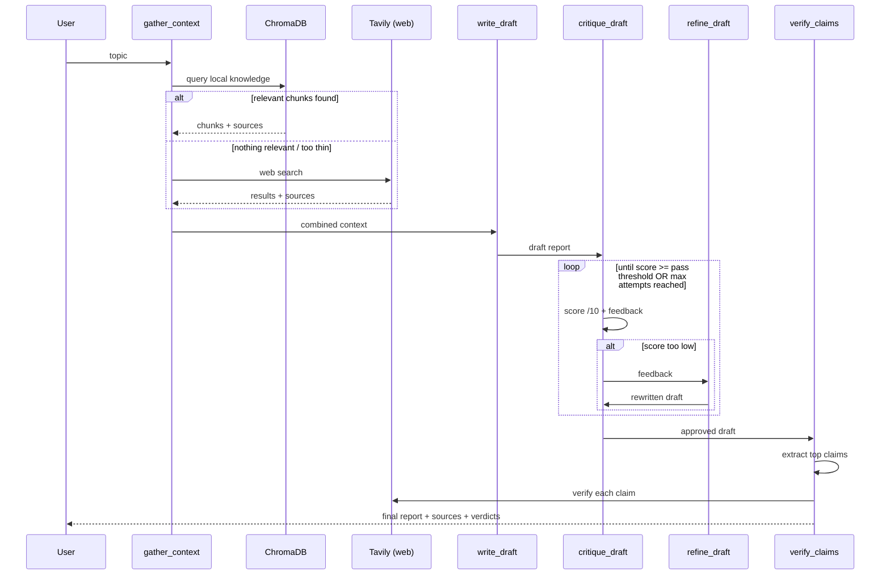

<div align="center">

# 🧠 Noesis AI

### A self-critiquing research agent that fact-checks its own work

*Ground it in your own documents. Fill the gaps with live web search. Let it grade, rewrite, and verify itself — before you ever see the report.*

[](https://www.python.org/)
[](https://www.langchain.com/langgraph)
[](https://groq.com/)
[](https://www.trychroma.com/)
[](https://streamlit.io/)
[](#license)

</div>

---

## 💡 What is this?

Most "RAG chatbot" projects answer questions from a fixed set of documents. **Noesis AI does something different** — give it a topic, and it behaves like a junior researcher who:

1. Checks what it already knows (your uploaded documents) before doing anything else
2. Goes and searches the live web only to fill in what's missing
3. Writes a full structured report — not a one-line answer
4. **Grades its own report** like a strict editor would
5. If the grade is too low, **rewrites it** based on that feedback
6. Pulls out the report's key factual claims and **verifies each one** against fresh evidence
7. Hands you a final report with sources *and* a claim-by-claim verdict

No human tells it what's wrong at any point in that loop. It plans, drafts, critiques, fixes, and verifies itself.

> **A RAG chatbot answers questions from documents. Noesis AI plans a report, checks its own work, fixes itself, and verifies its facts.**

---

## ✨ Features

| | |
|---|---|
| 🔀 **Hybrid retrieval** | Checks your own ChromaDB knowledge base first; only falls back to live web search (Tavily) when local knowledge is missing or too thin |
| 🎚️ **Web-only mode toggle** | One checkbox forces the agent to skip local documents entirely, even if they're loaded — full control per run |
| ✍️ **Self-critique loop** | An LLM grades its own draft out of 10 and gives specific, actionable feedback |
| 🔁 **Bounded auto-refine** | If the score is too low, the report gets rewritten against that feedback — capped at a max number of attempts so it can never loop forever |
| ✅ **Claim verification** | Extracts the report's key factual claims and independently checks each one — labeled `VERIFIED`, `UNVERIFIED`, or `CONTRADICTED` |
| 📚 **Transparent sourcing** | Every report ships with a full source list — which parts came from your documents vs. the live web |
| 📡 **Live pipeline view** | Watch each stage happen in real time (`st.status`) instead of staring at a frozen screen until the whole run finishes |
| 🗂️ **Simple ingestion** | Drop PDFs/TXT into a folder, run one script, done — no manual chunking or embedding code to write |
| 🎨 **Custom UI, zero JS build step** | Clean single-page Streamlit frontend, fully themeable via one CSS block |

---

## 🏗️ Architecture

Noesis AI is a single [LangGraph](https://www.langchain.com/langgraph) state machine with 5 nodes. One shared `ResearchState` dictionary flows through every step.



### Design decisions — and why

| Decision | Reasoning |
|---|---|
| **Hybrid retrieval over pure web search** | Most research-agent tutorials only hit the web. Grounding in your own knowledge first is cheaper, faster, and more trustworthy when relevant material already exists locally. |
| **Refine rewrites the report, not the search query** | Keeps the loop to a single LLM call per attempt — fix known issues directly, instead of re-running search with a smarter query. |
| **Claim extraction + verification combined into one node** | Fewer moving parts than splitting them into separate agents, with no real loss of capability. |
| **Bounded refine loop (`MAX_REFINE_ITERATIONS`)** | Self-critique loops can spiral forever if the critic is never satisfied. A hard cap guarantees termination. |
| **Distance-threshold filtering on local retrieval** | ChromaDB always returns *something* for a query — even irrelevant chunks. A similarity cutoff keeps unrelated documents from contaminating the report. |

---

## 🔄 Pipeline flow, in detail



---

## 📁 Project structure

```
noesis_ai/
├── app.py              # Streamlit UI — single page, custom CSS, live progress
├── graph.py             # The LangGraph pipeline — all 5 nodes live here
├── tools.py              # ChromaDB local search + Tavily web search wrappers
├── ingest.py               # Loads documents/ folder into ChromaDB
├── config.py                # Every tunable setting in one place
├── documents/                 # Drop your PDFs / TXT files here
├── requirements.txt
└── .env.example
```

---

## 🚀 Getting started

### 1. Clone & set up a virtual environment
```bash
git clone https://github.com/<your-username>/noesis-ai.git
cd noesis-ai

python -m venv .venv
# Windows:
.venv\Scripts\Activate.ps1
# macOS/Linux:
source .venv/bin/activate
```

### 2. Install dependencies
```bash
pip install -r requirements.txt
```

### 3. Add your API keys
```bash
cp .env.example .env
```
```env
GROQ_API_KEY=your_groq_key_here
TAVILY_API_KEY=your_tavily_key_here
```
Get a free Groq key at [console.groq.com](https://console.groq.com) and a Tavily key at [tavily.com](https://tavily.com).

### 4. (Optional) Teach it your own documents
```bash
# Drop PDFs / TXT files into documents/, then:
python ingest.py
```
Skipping this step is fine — Noesis AI automatically falls back to pure web research when the local knowledge base is empty.

### 5. Run it
```bash
streamlit run app.py
```
Then open **http://localhost:8501**.

---

## ⚙️ Configuration

All tunable behavior lives in `config.py` — no need to touch the pipeline code to adjust it:

| Setting | Default | Controls |
|---|---|---|
| `DISTANCE_THRESHOLD` | `0.9` | How strict the "is this local chunk actually relevant?" check is |
| `CRITIQUE_PASS_SCORE` | `7.0` | Score (out of 10) the draft needs to stop refining |
| `MAX_REFINE_ITERATIONS` | `2` | Hard cap on rewrite loops |
| `MAX_CLAIMS_TO_VERIFY` | `4` | How many claims get fact-checked per report |
| `TOP_K_LOCAL_CHUNKS` | `4` | How many chunks are pulled from ChromaDB per query |
| `CHUNK_SIZE` / `CHUNK_OVERLAP` | `800` / `100` | Document chunking granularity during ingestion |

---

## 🖥️ Tech stack

| Layer | Technology |
|---|---|
| Orchestration | [LangGraph](https://www.langchain.com/langgraph) |
| LLM | [Groq](https://groq.com/) (Llama 3.3 70B) |
| Vector store | [ChromaDB](https://www.trychroma.com/) |
| Embeddings | Sentence-Transformers (`all-MiniLM-L6-v2`, runs locally) |
| Web search | [Tavily](https://tavily.com/) |
| Frontend | [Streamlit](https://streamlit.io/) |
| PDF/text parsing | `pypdf`, LangChain text splitters |

---

## 🗺️ Roadmap

- [ ] Dockerize the full stack for one-command deployment
- [ ] Multi-topic batch research (run several topics in one session)
- [ ] Export reports as PDF, not just Markdown
- [ ] Swap the fixed distance threshold for an LLM-judged relevance check
- [ ] Add citation-level linking (claim → exact source chunk/URL, not just a source list)
- [ ] Session history — revisit past research reports without re-running them
- [ ] Pluggable LLM backend (swap Groq for OpenAI/Anthropic/local models via config)

---

## 🤝 Contributing

Issues and PRs are welcome. If you're proposing a change to the pipeline itself (`graph.py`), please open an issue first describing the design change — the node structure is intentionally kept minimal.

---

## 📄 License

MIT — do whatever you'd like with it, just don't hold me responsible if your critic node gives itself a 10/10 on the first try.

---

<div align="center">
Built by <a href="https://github.com/<your-username>">Saurabh</a> — feedback and stars appreciated ⭐
</div>
